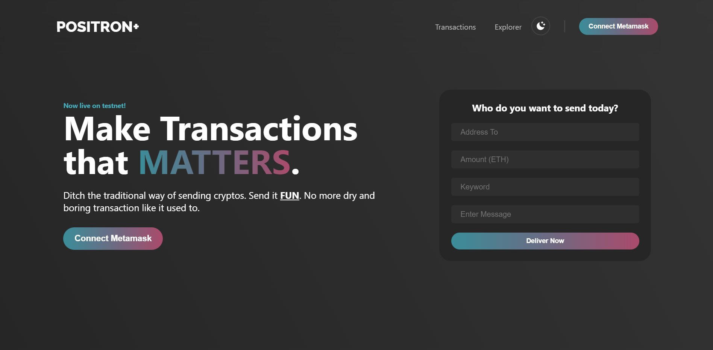
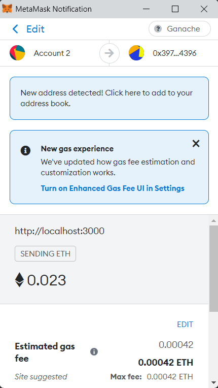
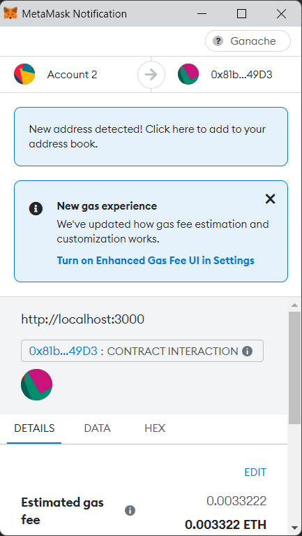
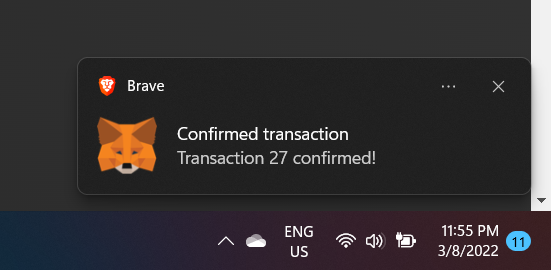
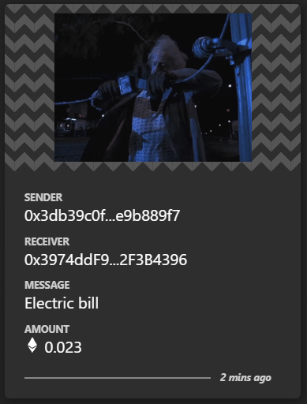
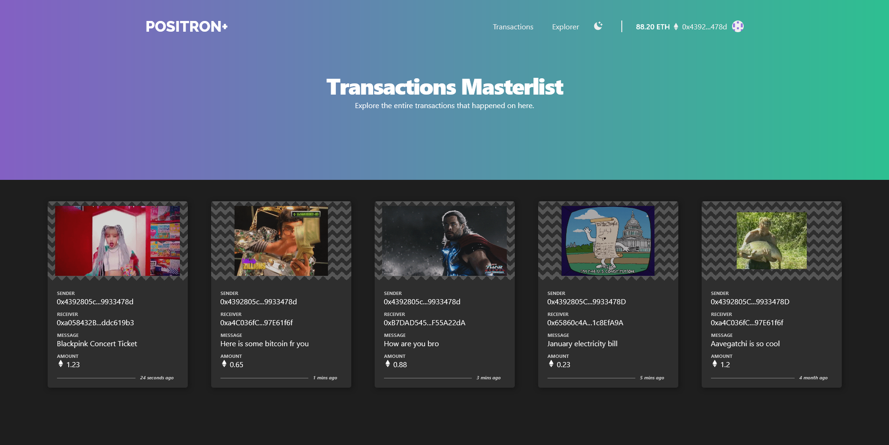
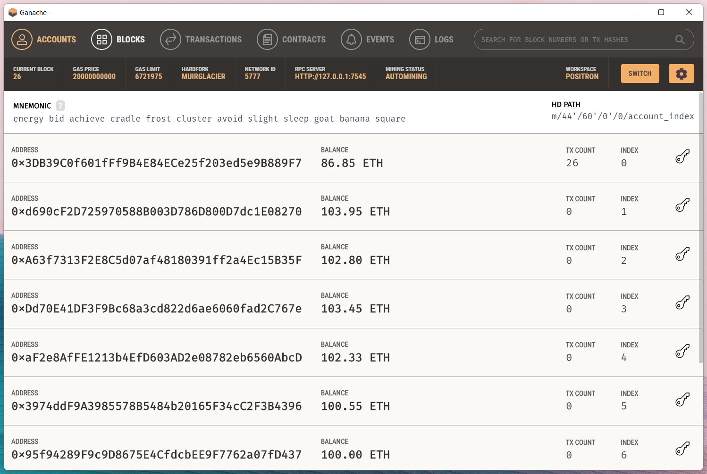
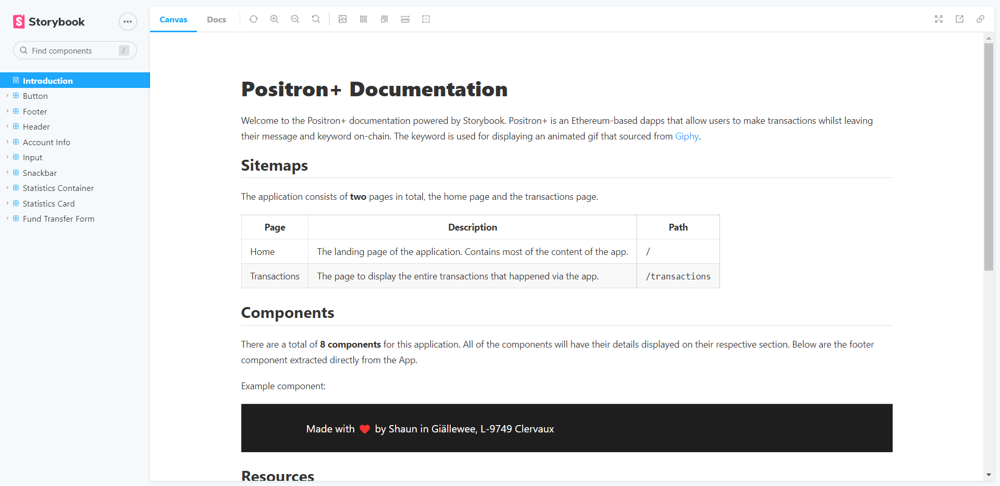

# Positron+

Positron+ is a simple dapps that allows user to send ethers and attach a message and keyword along with the transaction.

## Demo

Landing page of the Dapp.



After connecting the Metamask wallet and filling up the forms for transfer, two Metamask prompt will popup consequently. The first one is to confirm the transaction to send the ethers to the destination address.



The second prompt will ask for confirmation to interact with the smart contract so that the data will be written to the blockchain.



After executing all the transactions, Metamask will notify us upon confirmed transactions.



The transaction added will be displayed in a card.



All the transactions can be viewed in the `/transactions` page.



## Development

### Smart Contracts

Install Node dependencies

```
pnpm i
```

Build and compile the smart contracts within the `contracts` folder

```
pnpm build
```

> Building contracts will product an artifact called `Transaction.json` that is required by the client project. The file can be cloned by running `../scripts/copy_abi.ps1`

Deploy the compiled contracts to local Ethereum network

```
pnpm migrate
```

Spinup a local interactive Ethereum blockchain

```
pnpm dev
```

Alternatively, use [Truffle Ganache](https://trufflesuite.com/ganache/) to spinup a local Ethereum network with UI.



Run contract tests

```
pnpm test
```

Lint contracts

```
pnpm lint
```

### Client

To run the client locally, make sure to locate in the client first.

```
cd client
```

Installing Node dependencies by

```
yarn
```

Serve on localhost

```
yarn start
```

Running tests

```
yarn test
```

Build for deployment

```
yarn build
```

## Storybook

The development of the user interfaces are facilitated by the use of Storybook to document and produce prototypes quickly.



Start Storybook locally

```
yarn storybook

// or shortform
yarn sb
```

Build Storybook for hosting

```
yarn build-storybook
```

## Roadmaps

The list of milestones that is planned to fulfill following the initial release.

- [ ] Use [Web3.js]() instead of [Ethers.js]()
- [ ] Add more chain such as Algorand.
- [ ] Add light mode
- [ ] Customize Storybook
- [ ] Use Framer motion to animate elements
- [ ] Personalized profile avatar

## Credits

- [React Context API Crash Course - Basics, Best Practices, When to use it?...](https://www.youtube.com/watch?v=t9WmZFnE6Hg)

- [The Container Pattern for Better State Management](https://betterprogramming.pub/the-container-pattern-for-better-state-management-in-react-9351fe4381d1)

- [Presentational and Container Components](https://medium.com/@dan_abramov/smart-and-dumb-components-7ca2f9a7c7d0)

- [Pitfalls of Overusing React Context](https://blog.logrocket.com/pitfalls-of-overusing-react-context/)
